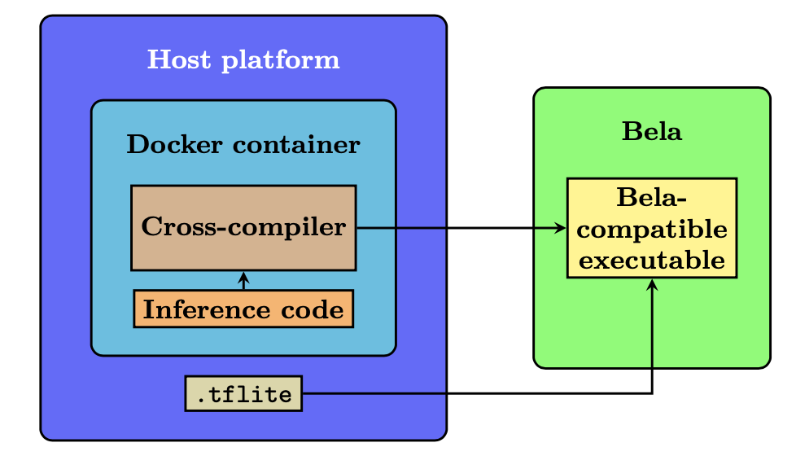

#  4 - Cross-compilation (in host)
**Warning: break of anonymity in `.devcontainer/devcontainer.json`**

Docker image/VSCode environment for [Bela](https://bela.io/) development and cross-compilation. Uses GCC 10, CMake and Make. By containerizing the cross-compilation toolchain, Bela code can be written and compiled on any host OS that can run Docker, and is compiled much faster and with more flexibility than in the Bela IDE. The VSCode environment is also set up for running GDB over SSH, allowing you to debug your Bela programs in the editor.

<center></center>
## Instructions

(Note: These instructions have been tested with the Bela `v0.5.0alpha` experimental [image](https://github.com/BelaPlatform/bela-image-builder/releases/tag/v0.5.0alpha2).)

This repo is set up to run the image as a VSCode development container. It should be able to work with other editors/IDEs with some setup, or even just as a terminal. However, the following instructions assume you're using VSCode.

1. Install [Docker](https://docs.docker.com/get-docker/) and the [Remote Development](https://marketplace.visualstudio.com/items?itemName=ms-vscode-remote.vscode-remote-extensionpack) extensions, if you haven't already.


2. Open the repo folder in VSCode and run the command `Remote-Containers: Reopen in Container` or click the popup when prompted. This will download the image, install a few extensions and attach the editor to the container.

3. At this stage, you can connect your Bela to your host machine. If you are using a Bela IP address different than the default one (`192.168.7.2`) you will need to modify it in the `.devcontainer/devcontainer.env` file and restart the container.

4. For the crosscompiled binaries to run in your Bela, you will need to copy the `libbelafull.so` and `armnn-dist` libraries from the Docker container into your Bela. You can do by opening an integrated terminal in VSCode (the command is `Terminal: Create New Integrated Terminal`) and typing:

    ```shell
    scp /sysroot/root/Bela/lib/libbelafull.so root@$BBB_HOSTNAME:Be
    la/lib/libbelafull.so
    scp -r /opt/armnn-dist/ root@$BBB_HOSTNAME:/opt/armnn-dist/
    ```

5. The workspace is stored as a Docker volume to improve disk performance, so it will be empty by default. You can now clone the `bela-model-inference` repo:
    ```shell
    git clone https://github.com/anon80999/b31a-m0d31-1nf3r3nc3.git
    ```
    you should also copy the TFLite model, obtained after step 3, inside of the cloned repo. 

6. You can use the CMake extension to configure and build now, or do it from the terminal:

    ```shell
    mkdir build # if it doesn't exist already
    cd build
    cmake -DCMAKE_TOOLCHAIN_FILE=../Toolchain.cmake ../
    cmake --build .
    ```

7. After a successful build, the binary (in `build/bin`) and the TFLite model will be copied via `scp` to the attached Bela at the IP address `BBB_HOSTNAME` (as specified in your env file.) In the Bela, you can run the model by running:
    ```
    ./forecasting -m model.tflite
    ```
